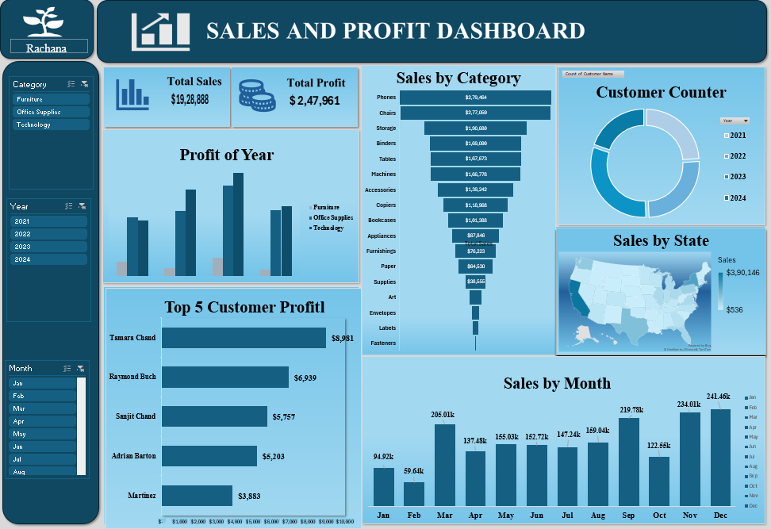

# 📊 Sales and Profit Dashboard 

## 📌 Project Overview

The Sales and Profit Dashboard is an interactive Excel-based business intelligence solution designed to analyze sales performance, profitability, customer trends, and regional distribution.

This dashboard transforms raw sales data into meaningful insights using data visualization techniques and dynamic filtering.

## 🎯 Key Features

- ✅ Total Sales KPI  
- ✅ Total Profit KPI  
- 📈 Sales by Month Analysis  
- 📊 Year-wise Profit Comparison  
- 🏆 Top 5 Customers by Profit  
- 📦 Sales by Category (Funnel Chart)  
- 🗺️ Sales by State (Map Chart)  

## 🎛️ Interactive Slicers

The dashboard includes dynamic slicers for:

- 🔹 Category  
- 🔹 Month  
- 🔹 Year  

These slicers allow real-time filtering across all visualizations for better business decision-making.

## 🛠 Tools & Skills Used

- Microsoft Excel  
- Pivot Tables & Pivot Charts  
- Data Cleaning  
- Data Visualization  
- KPI Design  
- Interactive Dashboard Design  

## 📊 Business Insights Generated

- Identified top-performing customers  
- Analyzed monthly sales growth trends  
- Compared yearly profit performance  
- Evaluated category-wise contribution  
- Monitored regional sales distribution  

## 💼 Business Value

This dashboard helps management:

- Track performance efficiently  
- Identify profitable segments  
- Support data-driven strategy planning  
- Improve sales monitoring process  

## 🖼 Dashboard Preview

## 🖼 Furniture June 2021 Dashboard

